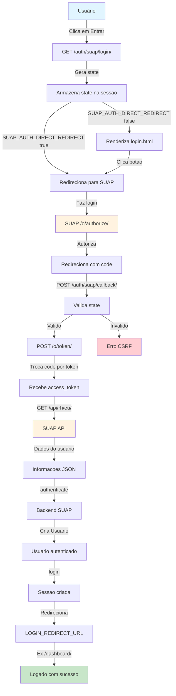

# Fluxo de Autenticação

## Visão Geral

django-suap-auth implementa o fluxo de autorização de código OAuth2.

## Redirecionamento Direto (Padrão)

Com `SUAP_AUTH_DIRECT_REDIRECT = True` (padrão), o usuário é imediatamente redirecionado para SUAP quando visita `/auth/suap/login/`.

## Página Intermediária

Com `SUAP_AUTH_DIRECT_REDIRECT = False`, a view de login renderiza uma página intermediária (`django_suap_auth/login.html`) onde o usuário deve clicar em um botão para prosseguir para SUAP.

## Proteção CSRF

O parâmetro de estado é gerado usando `secrets.token_urlsafe(32)` e armazenado na sessão. Ele é validado no callback para prevenir ataques CSRF.
